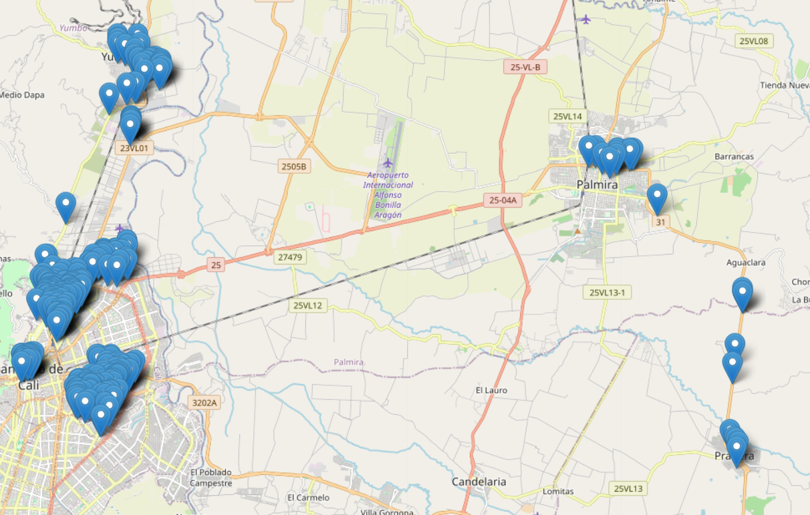

# 📌 GeoCuadrantesApp: Asignación de Nodos Geográficos



GeoCuadrantesApp es una aplicación en **Python** con **Tkinter, GeoPandas y Folium** que permite cargar archivos **Excel y KMZ**, asignar nodos a puntos geográficos y visualizar los resultados en un mapa interactivo. Además, genera un **mapa HTML dinámico** que permite explorar la distribución de los cuadrantes de manera interactiva.

## 🚀 Características

- 📂 **Carga de datos** desde **Excel** (`.xlsx`) con coordenadas.
- 🌍 **Carga de archivos KMZ** con la delimitación de zonas o cuadrantes.
- 🔍 **Asignación automática de cuadrantes** basada en proximidad y pertenencia geográfica.
- 🗺️ **Generación de mapas interactivos** con Folium, exportados como HTML.
- 🎨 **Interfaz gráfica intuitiva** con Tkinter.
- 💾 **Exportación de resultados** en **Excel** (`.xlsx`).

## 🌐 Visualización Interactiva

Puedes ver el mapa generado en el siguiente archivo:
[🔗 **Ver Mapa Interactivo**](mapa_nodos.html)

## 📂 Estructura del Proyecto

```
📁 GeoCuadrantesApp
│── 📄 geo_cuadrantes.py  # Código principal
│── 📄 README.md  # Documentación del proyecto
│── 📄 requirements.txt  # Dependencias necesarias
│── 📄 LICENSE  # Licencia del proyecto
│── 📄 mapa_nodos.html  # Mapa interactivo generado
│── 📄 Mapa.png  # Captura de pantalla del mapa
```

## 🛠️ Instalación y Uso

### 📥 Descarga del Proyecto

Puedes descargar el proyecto desde:
[📎 **Descargar GeoCuadrantesApp**](https://github.com/dashmonroy/GeoCuadrantesApp/archive/refs/heads/main.zip)

### 🔧 Instalación

1. **Clona este repositorio** o descárgalo manualmente:
   ```bash
   git clone https://github.com/dashmonroy/GeoCuadrantesApp.git
   cd GeoCuadrantesApp
   ```
2. **Instala las dependencias**:
   ```bash
   pip install -r requirements.txt
   ```
3. **Ejecuta la aplicación**:
   ```bash
   python geo_cuadrantes.py
   ```

## 📍 Funcionamiento

1️⃣ **Carga los archivos** Excel (`.xlsx`) con coordenadas de puntos y un **KMZ** con la delimitación de cuadrantes.  
2️⃣ **Procesa los datos**, asignando nodos a cada punto basado en proximidad.  
3️⃣ **Visualiza los resultados en un mapa** con Folium.  
4️⃣ **Guarda los resultados en Excel** (`.xlsx`).

## 🎯 Aplicaciones

- **Optimización de rutas y zonas geográficas.**
- **Asignación de cuadrantes en análisis urbano y de seguridad.**
- **Visualización interactiva de datos espaciales.**

## 📜 Licencia

Este proyecto está bajo la licencia MIT. Ver el archivo `LICENSE` para más detalles.
